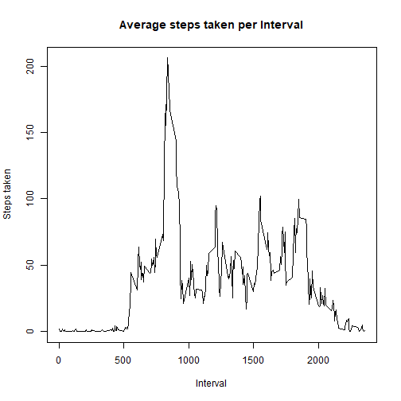

## Loading and preprocessing the data
Unzip the file and read the content from the file

```r
unzip('activity.zip')
activity<-read.csv('activity.csv')
```
Convert the date to character

```r
activity$date <- as.character(activity$date)
```


## What is mean total number of steps taken per day?
Calculate total number of steps taken per day, calculate mean and median


```r
stepsDay <- aggregate(activity$steps, by=list(activity$date), FUN=sum, na.rm=FALSE)
stepsDayMean <- mean(stepsDay$x, na.rm=TRUE)
stepsDayMedian <- median(stepsDay$x, na.rm=TRUE)
```

A histogram showing the total number of steps taken each day

```r
hist(stepsDay$x, 
     main="Total number of steps per day", 
     xlab="Steps taken")
```


The mean of steps taken per day is **10766**.
The median of steps taken per day is **10765**.


## What is the average daily activity pattern?
1. Make a time series plot (i.e. type = "l") of the 5-minute interval (x-axis) and the average number of steps taken, averaged across all days (y-axis)


```r
Interval <- aggregate(activity$steps, by=list(activity$interval), FUN=mean, na.rm=TRUE)

plot( x=Interval[,1], 
      y=Interval[,2], 
      type="l",
      main="Average steps taken per Interval",
      ylab="Steps taken", 
      xlab="Interval")
```



2. Which 5-minute interval, on average across all the days in the dataset, contains the maximum number of steps?

```r
maxInterval <- Interval[which.max(Interval[,2]),1]
```
The 5-minute interval that contains the maximum number of steps on average across all the days in the dataset is **835**.

## Imputing missing values
1. Calculate and report the total number of missing values in the dataset (i.e. the total number of rows with NAs)


```r
missingvalues <- sum(is.na(activity))
completevalues <- sum(complete.cases(activity))
```


2.There are **2304** missing values and **15264**
complete values in our dataset.
To fill the missing values, we match interval ids and use the mean steps across all days for a given interval to populate the NAs in the newly created dataframe


3.Create a new dataset that is equal to the original dataset but with the missing data filled in.


```r
completeactivity <- cbind(activity, Interval[,2])
names(completeactivity)[4] <- c("mean")

completeactivity$steps <- ifelse( is.na(completeactivity$steps), completeactivity$mean, completeactivity$steps)
```

4.Make a histogram of the total number of steps taken each day and Calculate and report the mean and median total number of steps taken per day. Do these values differ from the estimates from the first part of the assignment? What is the impact of imputing missing data on the estimates of the total daily number of steps?

We calculate the new mean and median

```r
newStepsDay <- aggregate(completeactivity$steps, by=list(completeactivity$date), FUN=sum)
newStepsDayMean <- mean(newStepsDay$x)
newStepsDayMedian <- median(newStepsDay$x)
```
For the recalculated dataset, the mean of steps taken per day is **10766**. The median of steps taken per day is **10766**

Draw a histogram of the total step count for each day


```r
hist(newStepsDay$x, 
     main="Total number of steps take per day", 
     xlab="Steps taken")
```


There isn't a big difference between the mean and median of the two datasets because the missing values filled are calculated from the mean values of the interval. There is no big difference between mean and median steps between the two original and completed dataframes.

## Are there differences in activity patterns between weekdays and weekends?

1. Create a new factor variable in the dataset with two levels - "weekday" and "weekend" indicating whether a given date is a weekday or weekend day. We convert the date field to date class using strptime function

```r
completeactivity$date <- strptime(completeactivity$date, "%Y-%m-%d")

completeactivity$weekend <- (weekdays(completeactivity$date) %in% c("Sunday", "Saturday"))

weekends <- completeactivity[completeactivity$weekend == TRUE,]
weekdays <- completeactivity[completeactivity$weekend == FALSE,]
```


2. Make a panel plot containing a time series plot (i.e. type = "l") of the 5-minute interval (x-axis) and the average number of steps taken, averaged across all weekday days or weekend days (y-axis).
    
We calculate the average steps for each interval for the two subsets and draw the graphics.

```r
weekendSteps <- aggregate(weekends$steps, by=list(weekends$interval), FUN=mean)
weekdaySteps <- aggregate(weekdays$steps, by=list(weekdays$interval), FUN=mean)

par(mfrow=c(2,1))

plot( x=weekendSteps[,1], 
      y=weekendSteps[,2], 
      type="l",
      col=124,
      main="Weekend average steps per interval",
      ylab="Average steps", 
      xlab="Interval id")

plot( x=weekdaySteps[,1], 
      y=weekdaySteps[,2], 
      type="l",
      col=554,
      main="Weekday average steps per interval",
      ylab="Average steps", 
      xlab="Interval id")
```


There is a difference in the pattern of steps taken between weekdays and weekends. The weekdays have an early peak and then become lower for the rest of the day, which can be interpreted to lower activities during working hours
